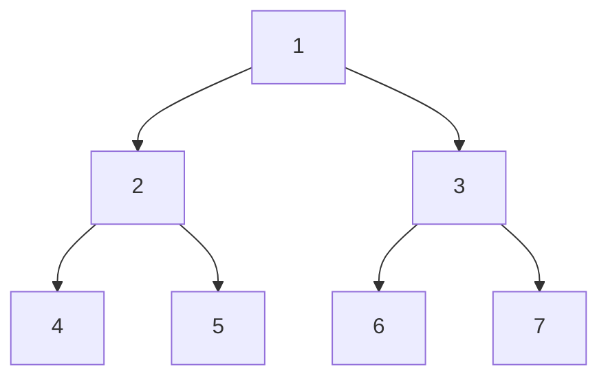

[TOC]


# 基础知识

补充：优先队列 (大根堆 / 小根堆) 的 JavaScript 实现

```js
const defaultFunc = (a, b) => a < b

const swap = (arr, i, j) => ([arr[i], arr[j]] = [arr[j], arr[i]]);

class PriorityQueue {
  constructor(func) {
    this.container = []
    this.func = func ? func : defaultFunc
  }

  size() {
    return this.container.length
  }

  isEmpty() {
    return this.container.length === 0 ? true : false
  }

  // 返回队首元素，但不出列
  peek() {
    if (this.size() === 0) {
      console.log('Queue is empty');
      return
    }
    return this.container[0]
  }

  // 内置浮出下沉函数
  _siftUp(index) {
    while (index > 0) {
      let parent = (index - 1) >> 1
      if (this.func(this.container[index], this.container[parent])) {
        swap(this.container, index, parent)
        index = parent
      } else break
    }
  }

  _siftDown(index) {
    let left = 2 * index + 1
    while (left < this.size()) {
      let next = (left + 1 < this.size()) && this.func(this.container[left + 1], this.container[left]) ? left + 1 : left
      next = this.func(this.container[next], this.container[index]) ? next : index
      if (next === index) break
      swap(this.container, next, index)
      index = next
      left = 2 * index + 1
    }
  }


  // 返回并出列队首元素
  pool() {
    if (this.size() === 0) {
      console.log('Queue is empty');
      return
    }
    let last = this.size() - 1
    swap(this.container, 0, last)
    let res = this.container.pop()
    let i = 0
    this._siftDown(i)

    return res
  }

  // 添加元素，并自动调整成优先队列
  add(item) {
    this.container.push(item)
    let i = this.size() - 1
    this._siftUp(i)
  }
}
```


## 时间复杂度

时间复杂度为一个算法流程中，常数操作数量的一个指标。常用O(读作big O)来表示。具体来说，先要对一个算法流程非常熟悉，然后去写出这个算法流程中，发生了多少常数操作，进而总结出常数操作数量的表达式。在表达式中，只要高阶项，不要低阶项，也不要高阶项的系数，剩下的部分如果为f(N)，那么时间复杂度为O(f(N))。

### 异或运算

运算规则：

* 任何数和自己异或=0 `a ^ a = 0`
* 0和任何数异或=其本身 `a ^ 0 = a`
* 异或运算支持交换律和结合律

异或可以理解为二进制的**无进位相加**，例如：

`a = 101101` `b = 110100` 则 `a ^ b = 011001`

运算技巧：异或可以用来交换两个数，前提是两个内存区域不相同

```js
a = a ^ b;
b = a ^ b;
a = a ^ b;
// a 和 b 交换完成
```

例题：一个数组内，有一个数出现了奇数次，其他的数均出现了偶数次，找到这个数

```js
// 定义一个 eor = 0，让它和数组内所有的数进行异或运算，最后剩下的就是这个数
```

进阶：一个数组内，有两个数出现了奇数次，其他的数均出现了偶数次，找到这个两数

```js
// 定义一个 eor = 0，让它和数组内所有的数进行异或运算，最后 eor = a ^ b
// 因为 eor !== 0,说明 eor 转换为二进制后，必有一位不等于 0，这意味着 a 和 b 在该位置不相同
// 找到 eor 最右侧不等于 0 的位置，定义一个 eor_1 = 0， 进行位运算，得到 eor_1 = a || b
// eor 和 eor_1 进行异或运算，得到 a 和 b
function findNumber(arr) {
  let eor = 0
  for (num of arr) {
    eor ^= num
  }
  // eor 取反+1，再和自己进行与运算，找到最右侧不等于0的位
  let rightOne = eor && (~eor + 1)

  let eor_1 = 0
  for (let num of arr) {
    if (rightOne && num !== 0) {
      eor_1 ^= num
    }
  }

  eor ^= eor_1
  return [eor, eor_1]
}

```

### Master公式

对于递归行为时间复杂度估算，**若子问题规模相同**，则可使用 Master 公式

`T(N) = a * T(N/b) + O(N^d)`

* `log(b,a) > d` 则复杂度为 `O(N^log(b, a))`
* `log(b,a) = d` 则复杂度为 `O(N^d * logN)`
* `log(b,a) < d` 则复杂度为 `O(N^d)`


## 排序

### O(N^2)排序算法

#### 选择排序

* 在未排序数列中找到最小(最大)的数，放到当前排序轮的起始位置

```js
function selectSort(arr) {
  for (let i = 0; i < arr.length; i++) {
    let minIndex = i
    for (let j = i; j < arr.length; j++) {
      minIndex = arr[j] < arr[minIndex] ? j : minIndex
    }
    [arr[i], arr[minIndex]] = [arr[minIndex], arr[i]]
  }
}
```

#### 冒泡排序

* 两两比较，把大的放在右边，直到最大的沉到最右边
* 长度-1，两两比较，让最大的沉到最右边

```js
function bubbleSort(arr) {
  for (let i = 0; i < arr.length; i++) {
    for (let j = 1; j < arr.length - i; j++) {
      if (arr[j - 1] > arr[j])[arr[j], arr[j - 1]] = [arr[j - 1], arr[j]]
    }
  }
}
```

#### 插入排序

* 将无序的元素插入到有序的元素序列中，插入后仍然有序
* 从左至右都是排序好的，如果当前轮最右侧最大，则可以停止比较，直接进入下一轮

```js
function insertSort(arr) {
  if (arr === null || arr.length < 2) return;
  for (let i = 1; i < arr.length; i++) {
    for (let j = i - 1; j >= 0 && arr[j] > arr[j + 1]; j--) {
      [arr[j], arr[j + 1]] = [arr[j + 1], arr[j]]
    }
  }
}
```


### O(N*logN)排序算法

#### 归并排序

* 从中一分为二，对两侧分别进行递归
* 合并的时候比较每一项的大小，依次放入 help 数组中

```js
function mergeSort(arr) {
  if (arr.length <= 1) return
  process(arr, 0, arr.length - 1)
}

function process(arr, L, R) {
  if (L === R) return
  let mid = L + ((R - L) >> 1)
  process(arr, L, mid)
  process(arr, mid + 1, R)
  merge(arr, L, mid, R)
}

function merge(arr, L, M, R) {
  const help = []
  let i = 0
  let p1 = L
  let p2 = M + 1
  while (p1 <= M && p2 <= R) {
    help[i++] = arr[p1] < arr[p2] ? arr[p1++] : arr[p2++]
  }
  while (p1 <= M) {
    help[i++] = arr[p1++]
  }
  while (p2 <= R) {
    help[i++] = arr[p2++]
  }
  for (let i = 0; i < help.length; i++) {
    arr[L + i] = help[i]
  }
}
```

练习1：小和问题

* 对数组中当前元素左侧，比它小的进行求和
* 比如 `[2,1,3,5,4]` 对于 3 就是 2 + 1，对于 5 就是 2 + 1 + 3，对于 4 就是 2 + 1 + 3，最后求和
* 求解思路可以当作归并排序的变体，在每次归并的时候进行判断是否右侧大于左侧，并求和

```js
function smallSum(arr) {
  if (arr.length <= 1) return 0
  return process(arr, 0, arr.length - 1)
}

function process(arr, l, r) {
  if (l === r) return 0
  let mid = l + ((r - l) >> 1)
  return process(arr, l, mid) + process(arr, mid + 1, r) + merge(arr, l, mid, r)
}

function merge(arr, l, mid, r) {
  const help = []
  let res = 0
  let i = 0
  let p1 = l
  let p2 = mid + 1
  while (p1 <= mid && p2 <= r) {
    res += arr[p1] < arr[p2] ? arr[p1] * (r - p2 + 1) : 0
    help[i++] = arr[p1] < arr[p2] ? arr[p1++] : arr[p2++]
  }
  while (p1 <= mid) {
    help[i++] = arr[p1++]
  }
  while (p2 <= r) {
    help[i++] = arr[p2++]
  }
  for (i = 0; i < help.length; i++) {
    arr[l + i] = help[i]
  }
  return res
}
```


#### 快速排序

* 目标是分成三部分，小于 num 的部分，等于 num 的部分，大于 num 的部分，递归地进行
* 先选出一个数 num 放在队尾，之后进入 partition
* 从左往右检索
  * 若小于 num，左边界++，当 arr[左指针] 和 arr[左边界] 互换，左指针++
  * 若等于 num，左指针++
  * 若大于 num，arr[右边界] 和 arr[左指针] 互换，右边界--
* 最后 arr[右边界] 和 arr[右指针] 互换，完成 partition，返回左边界+1和右边界

```js
function quickSort(arr) {
  if (arr.length < 2) return
  process(arr, 0, arr.length - 1)
}

function process(arr, l, r) {
  if (l < r) {
    let random = Math.floor(Math.random() * (r - l + 1));
    [arr[r], arr[l + random]] = [arr[l + random], arr[r]]
    const p = partition(arr, l, r)
    process(arr, l, p[0] - 1)
    process(arr, p[1] + 1, r)
  }
}

function partition(arr, l, r) {
  let left_edge = l - 1
  let right_edge = r
  while (l < right_edge) {
    if (arr[l] < arr[r]) {
      ++left_edge;
      [arr[left_edge], arr[l]] = [arr[l], arr[left_edge]]
      l++;
    } else if (arr[l] === arr[r]) {
      l++
    } else {
      [arr[l], arr[right_edge - 1]] = [arr[right_edge - 1], arr[l]];
      right_edge--
    }
  }
  [arr[r], arr[right_edge]] = [arr[right_edge], arr[r]];
  return [left_edge + 1, right_edge]
}
```

简易版：

```js
function quickSort(nums) {
  process(nums, 0, nums.length - 1)
}

function process(nums, L, R) {
  if (L >= R) return
  let num = nums[R]
  let pL = L - 1,
    pR = R
  let i = L
  while (i < pR) {
    if (nums[i] < num) {
      [nums[pL + 1], nums[i]] = [nums[i], nums[pL + 1]]
      pL++
      i++
    } else if (nums[i] === num) {
      i++
    } else {
      [nums[pR - 1], nums[i]] = [nums[i], nums[pR - 1]]
      pR--
    }
  }
  [nums[R], nums[pR]] = [nums[pR], nums[R]]
  pR++
  process(nums, L, pL)
  process(nums, pR, R)
}
```


#### 堆排序

对于一个数组，把它当作一棵树来看的话，下标含义如下：

* 左孩子 2 * i + 1
* 右孩子 2 * i + 2
* 父亲 (i - 1) / 2

算法思路：

* 先假设 heapSize = 0，从数组的第一个数开始，通过 heapInsert 构建一个堆
  * 判断当前值是否比父亲大，如果大，就上浮
* 构建好大根堆后，交换头部和尾部，这样最大的数换到了最后，同时 heapSize - 1
  * 对于换到头顶的数，比较它和它两个孩子的大小，让大的孩子浮上来
  * 直到换到头顶的数下沉到它该在的位置
  * 继续交换头部和尾部，同时 heapSize - 1

```js
function heapSort(arr) {
  if (arr === null || arr.length < 2) return

  // 进行堆插入，使其变成一个堆(从下往上)
  for (let i = 0; i < arr.length; i++) {
    heapInsert(arr, i)
  }

  let heapSize = arr.length;
  [arr[0], arr[heapSize - 1]] = [arr[heapSize - 1], arr[0]]
  heapSize--
  while (heapSize > 0) {
    heapify(arr, heapSize);
    [arr[0], arr[heapSize - 1]] = [arr[heapSize - 1], arr[0]]
    heapSize--
  }

}

function heapInsert(arr, index) {
  while (arr[index] > arr[(index - 1) >> 1]) {
    [arr[index], arr[(index - 1) >> 1]] = [arr[(index - 1) >> 1], arr[index]];
    index = (index - 1) >> 1
  }
}

function heapify(arr, heapSize) {
  let index = 0
  let left = 2 * index + 1
  while (left < heapSize) {
    let largest = (left + 1 < heapSize) && (arr[left] < arr[left + 1]) ? (left + 1) : left
    largest = arr[largest] > arr[index] ? largest : index
    if (largest === index) break;
    [arr[largest], arr[index]] = [arr[index], arr[largest]]
    index = largest
    left = 2 * index + 1
  }
}
```


### 桶排序

* 按位进桶出桶，以达到排序的目的
* 代码中运用统计词频来代替桶

```js
function radixSort(arr) {
  if (arr.length < 2) return
  process(arr, 0, arr.length - 1, maxbits(arr))
}

// 求最大的数一共有多少位
function maxbits(arr) {
  let max = -Infinity
  for (let i = 0; i < arr.length; i++) {
    max = Math.max(max, arr[i])
  }
  let res = 0
  while (max !== 0) {
    res++;
    max = Math.floor(max / 10)
  }
  return res
}

function process(arr, l, r, digit) {
  const radix = 10
  let i = 0
  let j = 0
  const bucket = new Array(r - l + 1).fill(0)
  for (let d = 1; d <= digit; d++) { // 有多少位就进出多少次
    const count = new Array(radix).fill(0)
    for (i = l; i <= r; i++) {
      j = getDigit(arr[i], d)
      count[j]++
    }
    for (i = 1; i < radix; i++) {
      count[i] = count[i] + count[i - 1]
    }
    for (i = r; i >= l; i--) {
      j = getDigit(arr[i], d)
      bucket[count[j] - 1] = arr[i]
      count[j]--
    }
    for (i = l, j = 0; i <= r; i++, j++) {
      arr[i] = bucket[j]
    }
  }
}

function getDigit(x, d) {
  return (Math.floor((x / Math.floor(Math.pow(10, d - 1)))) % 10)
}
```


### 总结

稳定性是指：排序过后，相同的元素相对位置不变

|   算法   | 时间复杂度 | 空间复杂度 | 稳定性 |
| :------: | :--------: | :--------: | :----: |
| 选择排序 |   O(N2)    |    O(1)    |   ×    |
| 冒泡排序 |   O(N2)    |    O(1)    |   √    |
| 插入排序 |   O(N2)    |    O(1)    |   √    |
| 归并排序 | O(N*logN)  |    O(N)    |   √    |
| 快速排序 | O(N*logN)  |  O(logN)   |   ×    |
|  堆排序  | O(N*logN)  |    O(1)    |   ×    |


## 链表

**例题：反转单向链表，要求：链表长度为n，时间复杂度O(N)，额外空间复杂度O(1)**

* 解法1：递归

```js
var reverseList = function(head) {
    if (head === null || head.next === null) {
        return head
    }
    const newHead = reverseList(head.next)
    head.next.next = head
    head.next = null
    return newHead
};
```

* 解法2：迭代

用两个变量，pre 记录前一个节点，next 记录后一个节点，从头开始修改

```js
function reverseList(head) {
  let pre = new Node()
  let next = new Node()
  while (head) {
    next = head.next
    head.next = pre
    pre = head
    head = next
  }
  return pre
}
```


**例题：反转双向链表，要求：链表长度为n，时间复杂度O(N)，额外空间复杂度O(1)**

```js
function reverseList(head) {
  let pre = new Node()
  let next = new Node()
  while (head) {
    next = head.next
    head.pre = next
    head.next = pre
    pre = head
    head = next
  }
  return pre
}
```


**例题：打印两个有序链表的公共部分，要求：链表长度为n，时间复杂度O(N)，额外空间复杂度O(1)**

* 利用双指针，小的往右走，相同的打印后同时往右走，直到其中一个走完


**例题：判断一个链表是否是回文结构，要求：链表长度为n，时间复杂度O(N)，额外空间复杂度O(1)**

* 解法1：利用栈结构，但是空间复杂度不是O(1)

```js
var isPalindrome = function(head) {
    if(head === null || head.next === null) return true
    let fast = head, slow = head
    while(fast !== null && fast.next !== null) {
        slow = slow.next
        fast = fast.next.next
    }
	slow = slow.next
    let stack = []
    while(slow !== null) {
        stack.push(slow.val)
        slow = slow.next
    }
    while(stack.length > 0) {
        if(head.val !== stack.pop()) return false
        head = head.next
    }
    return true
};
```

* 解法2：快慢指针找到中点之后，将中点之后的链表反向，例如 1 -> 2 -> 3 <- 2 <- 1，之后从两头开始遍历，直到相遇，最后再将其还原

```js
var isPalindrome = function(head) {
    if(head === null || head.next === null) return true
    let fast = head, slow = head
    while(fast.next !== null && fast.next.next !== null) {
        slow = slow.next
        fast = fast.next.next
    }
    fast = slow.next // 右半部分的第一个node
    slow.next = null // mid.next -> null
    let next = null
    while(fast !== null) {
        next = fast.next
        fast.next = slow
        slow = fast
        fast = next
    }
    next = slow
    fast = head
    let res = true
    while(slow !== null && fast !== null) {
        if(slow.val !== fast.val) {
            res = false
            break
        }
        slow = slow.next
        fast = fast.next
    }
    slow = next.next
    next.next = null
    while(slow !== null) {
        fast = slow.next
        slow.next = next
        next = slow
        slow = fast
    }
    return res
};
```


**例题：将单向链表按某值划分成左边小、中间相等、右边大的形式，要求**

* **调整之后的相对顺序和调整前一样**
* **时间复杂度O(N)，额外空间复杂度O(1)**

* 解法1：把节点放到数组中，对节点值进行基于快速排序思想的划分，但是此解法不能保证有序，且额外空间复杂度超标

```js
function listPartition(head, pivot) {
  const help = []
  let current = head
  while (current !== null) {
    help.push(current)
    let next = current.next
    current.next = null
    current = next
  }
  head = process(help, 0, help.length - 1, pivot)
  return head
}

function process(arr, left, right, pivot) {
  let l = left - 1
  let r = right + 1
  while (left < r) {
    if (arr[left].value < pivot) {
      [arr[left], arr[l + 1]] = [arr[l + 1], arr[left]]
      l++;
      left++;
    } else if (arr[left].value === pivot) {
      left++
    } else {
      [arr[left], arr[r - 1]] = [arr[r - 1], arr[left]]
      r--
    }
  }
  let pre = new Node()
  pre.next = arr[0]
  for (let i = 1; i < arr.length; i++) {
    arr[i - 1].next = arr[i]
  }
  return pre
}
```

* 解法2：自己创建三块链表，小于部分，等于部分，大于部分，遍历到每一个 node，根据其 value 大小连接到各自的部分上去，最后把他们连接在一起

```js
function listPartition(head, pivot) {
  let sH = null
  let sT = null
  let eH = null
  let eT = null
  let mH = null
  let mT = null
  let next = null
  while (head !== null) {
    let next = head.next
    head.next = null
    if (head.value < pivot) {
      if (sH === null) {
        sH = head
        sT = head
      } else {
        sT.next = head
        sT = sT.next
      }
    } else if (head.value === pivot) {
      if (eH === null) {
        eH = head
        eT = head
      } else {
        eT.next = head
        eT = eT.next
      }
    } else {
      if (mH === null) {
        mH = head
        mT = head
      } else {
        mT.next = head
        mT = mT.next
      }
    }
    head = next
  }
  if (sT !== null) {
    sT.next = eH
    eT = eT === null ? sT : eT
  }

  if (eT !== null) {
    eT.next = mH
  }

  return sH !== null ? sH : (eH !== null ? eH : mH)
}
```


## 二叉树

用递归和非递归两种方式实现二叉树的先序、中序、后序遍历

如何直观的打印一颗二叉树

如何完成二叉树的宽度优先遍历


**递归序：每一个节点都会被打印3次**



对于上述的树结构，用递归序进行遍历，每一个节点都会经过3次，而先序、中序、后序遍历，**无非就是打印的时机不同**

递归序经过顺序 `124442555213666377731`


### 递归遍历

构建一颗树

```js
class TreeNode {
  constructor(value, left, right) {
    this.value = (value === undefined ? 0 : value)
    this.left = (left === undefined ? null : left)
    this.right = (right === undefined ? null : right)
  }
}
let arr = [1, 2, 3, 4, 5, 6, 7]

function buildTree(arr, i, head) {
  if ((2 * i + 1) < arr.length) {
    head.left = new TreeNode(arr[2 * i + 1])
    buildTree(arr, 2 * i + 1, head.left)
    if (2 * i + 2 < arr.length) {
      head.right = new TreeNode(arr[2 * i + 2])
      buildTree(arr, 2 * i + 2, head.right)
    } else return
  } else return
}
let head = new TreeNode(arr[0])
buildTree(arr, 0, head)
```


* 先序

```js
let res = []
function preOrder(head) {
  if (head !== null) {
    res.push(head.value)
    preOrder(head.left)
    preOrder(head.right)
  } else return
}
preOrder(head)
```

* 中序

```js
let res = []
function inOrder(head) {
  if (head !== null) {
    preOrder(head.left)
    res.push(head.value)
    preOrder(head.right)
  } else return
}
inOrder(head)
```

* 后序

```js
let res = []
function postOrder(head) {
  if (head !== null) {
    preOrder(head.left)
    preOrder(head.right)
    res.push(head.value)
  } else return
}
postOrder(head)
```


### 迭代遍历

* 先序

开辟一个栈，每次先弹出栈顶节点保存，先压栈该节点右孩子，再压栈

```js
let res = []
function preOrder(head) {
  if(head === null) return
  const stack = []
  stack.push(head)
  while (stack.length) {
    let current = stack.pop()
    res.push(current)
    if (current.right) {
      stack.push(current.right)
    }
    if (current.left) {
      stack.push(current.left)
    }
  }
}
preOrder(head)
```


* 中序

每棵子树所有的左边界进栈，依次弹出，打印，对弹出节点的右边界做相同的动作

```js
let res = []
function inOrder(head) {
  if(head === null) return
  const stack = []
  while (stack.length > 0 || head !== null) {
    if (head !== null) {
      stack.push(head)
      head = head.left
    } else {
      head = stack.pop()
      res.push(head)
      head = head.right
    }
  }
}
inOrder(head)
```


* 后序

准备两个栈，普通栈和回收栈，从普通栈弹出 current 放入回收栈，先左后右将其孩子放入普通栈，依次重复进行

```js
function postOrder(head) {
  if(head === null) return
  const stack = []
  const recycle = []
  stack.push(head)
  while (stack.length) {
    let cur = stack.pop()
    recycle.push(cur)
    if (cur.left) {
      stack.push(cur.left)
    }
    if (cur.right) {
      stack.push(cur.right)
    }
  }
  while (recycle.length) {
    res.push(recycle.pop())
  }
}
postOrder(head)
```


### 层序遍历

利用队列

```js
function w(head) {
  if(head === null) return
  const q = []
  q.push(head)
  while (q.length > 0) {
    let cur = q.shift()
    res.push(cur)
    if (cur.left) {
      q.push(cur.left)
    }
    if (cur.right) {
      q.push(cur.right)
    }
  }
}
w(head)
```

* **例题：找到宽度最大的层**

首先想到可以用 Map 数据结构存储每个节点的层

如果不用 Map 则采用如下方法：

* 定义 curEnd、nextEnd、curCount 三个变量
  * curEnd 记录当前层的最后一个节点
  * nextEnd 记录最后放入队列的节点
  * curCount 记录当前层节点数量（宽度）
* 每次从队列中取出一个节点并判断：
  * curCount ++ 并更新 max
  * 先左后右进入队列，同时更新 nextEnd
  * 判断当前 cur === curEnd，如果相等，则 curEnd = nextEnd，清空 curCount 和 nextEnd

```js
function findMaxLevel(head) {
  if (head === null) return
  const q = []
  q.push(head)
  let max = 0
  let curCount = 0
  let curEnd = head
  let nextEnd = null
  while (q.length) {
    let cur = q.shift()
    curCount++;
    max = Math.max(curCount, max)
    if (cur.left) {
      q.push(cur.left)
      nextEnd = cur.left
    }
    if (cur.right) {
      q.push(cur.right)
      nextEnd = cur.right
    }
    if (cur === curEnd) {
      curCount = 0
      curEnd = nextEnd
      nextEnd = null
    }
  }
  return max
}
```


### Morris 遍历

一种二叉树遍历方式，时间复杂度 O(N)，**额外空间复杂度 O(1)**，通过利用原树中大量空闲指针的方式，达到节省空间的目的

算法思路：来到当前节点 cur

* 如果 cur 没有左孩子，cur 向右移动
* 如果 cur 有左孩子，找到左树上最右的节点 mostRight
  * 如果 mostRight 的右指针指向空，让其指向 cur，然后 cur 向左移动
  * 如果mostRight 的右指针指向 cur，让其指向 null，然后 cur 向右移动
* cur 为空时遍历停止

<strong style="color:red;">所有有左子树的节点都会经过两次，没有左子树的节点只会经过一次</strong>

```js
function morris(head) {
  if (head === null) return
  let cur = head
  let mostRight = null
  while (cur !== null) {
    mostRight = cur.left // mostRight 时 cur 的左孩子
    if (mostRight !== null) { // 如果有左子树
      while (mostRight.right !== null && mostRight.right !== cur) {
        mostRight = mostRight.right
      }
      // mostRight 变成了 cur 左子树上最右的节点
      if (mostRight.right === null) { // 这是第一次来到 cur
        mostRight.right = cur
        cur = cur.left
        continue
      } else { // 第二次来到 cur
        mostRight.right = null
      }
    }
    cur = cur.right
  }
}
```

先序遍历

```js
function morris(head) {
  if (head === null) return
  let cur = head
  let mostRight = null
  while (cur !== null) {
    mostRight = cur.left // mostRight 时 cur 的左孩子
    if (mostRight !== null) { // 如果有左子树
      while (mostRight.right !== null && mostRight.right !== cur) {
        mostRight = mostRight.right
      }
      // mostRight 变成了 cur 左子树上最右的节点
      if (mostRight.right === null) { // 这是第一次来到 cur
        mostRight.right = cur
        cur = cur.left
        continue
      } else { // 第二次来到 cur
        mostRight.right = null
      }
    } else {
      console.log(cur.value);
    }
    cur = cur.right
  }
}
```

中序遍历

```js
function morris(head) {
  if (head === null) return
  let cur = head
  let mostRight = null
  while (cur !== null) {
    mostRight = cur.left // mostRight 时 cur 的左孩子
    if (mostRight !== null) { // 如果有左子树
      while (mostRight.right !== null && mostRight.right !== cur) {
        mostRight = mostRight.right
      }
      // mostRight 变成了 cur 左子树上最右的节点
      if (mostRight.right === null) { // 这是第一次来到 cur
        mostRight.right = cur
        cur = cur.left
        continue
      } else { // 第二次来到 cur
        mostRight.right = null
      }
    }
    console.log(cur.value)
    cur = cur.right
  }
}
```

 后序遍历

当遇到第二次经过的节点时，逆序打印左树的右边界


### 二叉树题目递归套路

* 首先确定**向左右子树要什么信息**，作为每次递归的返回值
* 在递归开始时要先**确定递归到最后的判断条件**
*  获取左右子树的返回信息，对返回信息进行加工处理，计算和判断当前节点返回信息，进行返回


### 各类二叉树

#### 搜索二叉树

定义：若它的左子树不空，则左子树上所有结点的值均小于它的根结点的值； 若它的右子树不空，则右子树上所有结点的值均大于它的根结点的值； 它的左、右子树也分别为二叉排序树；

**如何判断一颗二叉树是否为搜索二叉树？**

**方法一：**使用中序遍历，搜索二叉树中序遍历后一定是升序的

**方法二：**二叉树的递归套路，找到左边和右边相同的返回条件，进行比较

* 左子树所有节点比当前节点小，右子树所有节点比当前节点大，那么需要 min 和 max
* 还需要一个标志位 isBST 来判断子树是否都为搜索二叉树
* 因此每次的返回值为 `{isBST, min, max}`

```js
function isBst(head) {
  if (head !== null) {
    return process(head).isBST
  }
}

function process(cur) {
  if (cur === null) return null

  let leftData = process(cur.left)
  let rightData = process(cur.right)

  let isBST = true
  let min = cur.value
  let max = cur.value
  if (leftData !== null) {
    min = Math.min(leftData.min, min)
    max = Math.max(leftData.max, max)
  }
  if (rightData !== null) {
    min = Math.min(rightData.min, min)
    max = Math.max(rightData.max, max)
  }

  if (leftData !== null && (leftData.max >= cur.value || !leftData.isBST)) {
    isBST = false
  }
  if (rightData !== null && (rightData.min <= cur.value || !rightData.isBST)) {
    isBST = false
  }

  return {
    isBST,
    min,
    max
  }
}
```


#### 完全二叉树

**如何判断一棵二叉树是否为完全二叉树？**

* 任意一个节点，如果有右无左，直接返回 false
* 如果遇到了第一个左右孩子不全（不违反上一条的情况下），后续的节点必须都是叶节点


#### 平衡二叉树

定义：任意节点的子树的高度差都小于等于1

**如何判断一棵二叉树是否为平衡二叉树？**

使用二叉树的递归套路，条件如下：

* 需要左子树的高度 和 右子树的高度，因此要返回 height
* 需要是否为平衡二叉树的标志位 isBalanced

```js
function isBT(head) {
  if (head !== null) {
    return process(head).isBalanced
  }
}

function process(cur) {
  if (cur === null) {
    return {
      isBalanced: true,
      height: 0
    }
  }

  let leftData = process(cur.left)
  let rightData = process(cur.right)
  let isBalanced = leftData.isBalanced && rightData.isBalanced && Math.abs(leftData.height - rightData.height) < 2
  let height = Math.max(leftData.height, rightData.height) + 1

  return {
    isBalanced,
    height
  }
}
```


#### 满二叉树

定义：满足 nodes === 2 ^ height - 1

**如何判断一棵二叉树是否为满二叉树？**

* 收集左右子树的节点数量和高度
* 返回进行判断

```js
function isFT(head) {
  if (head === null) return true
  let info = process(head)
  console.log(info);
  return info.nodes === Math.pow(2, info.height) - 1
}

function process(cur) {
  if (cur === null) {
    return {
      nodes: 0,
      height: 0
    }
  }
  let leftData = process(cur.left)
  let rightData = process(cur.right)
  let height = Math.max(leftData.height, rightData.height) + 1
  let nodes = leftData.nodes + rightData.nodes + 1
  return {
    nodes,
    height
  }
}
```


### 例题

**1、给定两个二叉树节点 node1 和 node2，找到他们的最低公共祖先节点**

* 方法一：建立一个 hashMap，记录节点-父节点，之后遍历 node1 所有父节点，存到一个 hashSet 中，再遍历 node2 父节点，如果查到 hashSet 中存在，则返回

```js
function lowestAncestor(head, o1, o2) {
  if (head === null) return
  let fatherMap = new Map()
  fatherMap.set(head, head)
  process(head, fatherMap)

  let hashSet = new Set()
  let cur = o1
  while (cur !== fatherMap.get(cur)) {
    hashSet.add(cur)
    cur = fatherMap.get(cur)
  }
  res = o2
  while (!hashSet.has(res) && res !== fatherMap.get(res)) {
    res = fatherMap.get(res)
  }
  return res
}

function process(cur, fatherMap) {
  if (cur.left !== null) {
    fatherMap.set(cur.left, cur)
    process(cur.left, fatherMap)
  }
  if (cur.right !== null) {
    fatherMap.set(cur.right, cur)
    process(cur.right, fatherMap)
  }
  return
}
```

* <strong style="color:#ff0000;">方法二：递归寻找 o1 和 o2，如果该子树找到了 o1 或 o2，则返回 o1 或 o2，如果没找到返回 null。当左右两边都不是 null 的时候，证明该节点是第一个公共节点</strong>

```js
function lowestAncestor(head, o1, o2) {
  if (head === null || head === o1 || head === o2) return head
  let left = lowestAncestor(head.left, o1, o2)
  let right = lowestAncestor(head.right, o1, o2)
  if (left !== null && right !== null) return head
  return left !== null ? left : right
}
```


**2、二叉树的序列化与反序列化**

先序序列化：

```js
function serialByPre(head) {
  if (head === null) return '#_'
  res = head.value + "_"
  res += serialByPre(head.left)
  res += serialByPre(head.right)
  return res
}
```

先序反序列化：

```js
function deserialize(data) {
  let list = data.split('_')
  const buildTree = (list) => {
    let val = list.shift()
    if(val === '#') return null
    const root = new TreeNode(val)
    root.left = buildTree(list)
    root.right = buildTree(list)
    return root
  }
  return buildTree(list)
};
```


**3、二叉树节点最大距离问题：二叉树从节点 a 出发，可以向上或向下走，每个节点只能经过一次，到达 b 时路径上的节点个数称为距离，求最大距离**

利用二叉树的递归套路进行求解

* 需要收集什么信息？左右子树的高度、左右子树内部的最大距离
* 对于当前节点 cur，算上 cur 后，应该返回怎样的信息？
  * 计算囊括 cur 的最大距离
  * 计算包含 cur 的最大高度

```js
class Info {
  constructor(dis, h) {
    this.maxDistance = dis
    this.height = h
  }
}

function maxDistance(head) {
  if (head === null) return
  process(head)
}

function process(cur) {
  if (cur === null) {
    return new Info(0, 0)
  }
  let leftInfo = process(cur.left)
  let rightInfo = process(cur.right)
  let p1 = leftInfo.maxDistance
  let p2 = rightInfo.maxDistance
  let p3 = leftInfo.height + rightInfo.height + 1
  let maxDistance = Math.max(p3, Math.max(p1, p2))
  let height = Math.max(leftInfo.height, rightInfo.height) + 1
  return new Info(maxDistance, height)
}
```


**4、派对的最大快乐值   (等同于力扣打家劫舍3)**

员工信息有一个快乐值，有一个下属数组，如果他来派对，那他的直系下属不能来，间接下属可以来，求派对的最大快乐值

* 当前节点参与
  * 当前节点 happy 值 + 所有下属不参与时，下属节点返回的最大快乐值
* 当前节点不参与
  * 0 + 所有下属参与、不参与时，下属节点返回的最大快乐值，参与与不参与二者取最大

```js
class Employee {
  constructor(happy, nexts) {
    this.happy = happy
    this.nexts = nexts ? nexts : null
  }
}

class Info {
  constructor(yes, no) {
    this.yesHappy = yes
    this.noHappy = no
  }
}

function maxHappy(head) {
  if (head === null) return
  let info = process(head)
  return Math.max(info.yesHappy, info.noHappy)
}

function process(cur) {
  if (cur.nexts === null) return new Info(cur.happy, 0)
  let yesHappy = cur.happy
  let noHappy = 0
  for (let next of cur.nexts) {
    let nextInfo = process(next)
    yesHappy += nextInfo.noHappy
    noHappy += Math.max(nextInfo.yesHappy, nextInfo.noHappy)
  }
  return new Info(yesHappy, noHappy)
}
```


## 图

首先要建立自己熟悉的图数据结构模板，这样遇到问题时，把问题中的数据结构转换成自己的数据结构，在编写算法，下面提供一种常用的图数据结构

* 图
  * Map 结构的 nodes，记录图中出现的所有 nodes
  * Set 结构的 edges，记录途中出现的所有 edges
* 节点
  * 入度 in，出度 out，值 value
  * 它的下一个节点，数组类型
  * 隶属于它的边，数组类型
* 边
  * 权重 weight
  * from 来自哪个节点， to 去往哪个节点

```js
class Graph {
  constructor() {
    this.nodes = new Map()
    this.edges = new Set()
  }
}

class Node {
  constructor(value) {
    this.in = 0
    this.out = 0
    this.value = value
    this.nexts = new Array()
    this.edges = new Array()
  }
}

class Edge {
  constructor(weight, from, to) {
    this.weight = weight
    this.from = from
    this.to = to
  }
}
```

下面用一个简单的转换例子进行数据结构转换

一个二维数组里面每一个元素存储着边的信息，有三个值，表示from，to，weight，转化成自己的数据结构

```js
function createGraph(matrix) {
  let graph = new Graph()
  for (let item of matrix) {
    let from = item[0]
    let to = item[1]
    let weight = item[2]
    if (!graph.nodes.has(from)) {
      graph.nodes.set(from, new Node(from))
    }
    if (!graph.nodes.has(to)) {
      graph.nodes.set(to, new Node(to))
    }
    let fromNode = graph.nodes.get(from)
    let toNode = graph.nodes.get(to)
    let newEdge = new Edge(weight, fromNode, toNode)
    fromNode.nexts.push(toNode)
    fromNode.out++
    toNode.in++
    fromNode.edges.push(newEdge)
    graph.edges.add(newEdge)
  }
  return graph
}
```

### 遍历

#### 广度优先遍历

利用队列实现，从源节点开始 依次按照宽度进队列，弹出，并把该节点**所有没有进过队列**的相邻节点放入队列，直到队列为空，因此需要一个 set 来标识**所有没有进过队列**的相邻节点，否则可能会进入死循环

```js
function bfs(node) {
  if (node === null) return
  let queue = []
  let set = new Set()
  queue.push(node)
  set.add(node)
  while (queue.length > 0) {
    let cur = queue.shift()
    console.log(cur)
    for (let next of cur.nexts) {
      if (!set.has(next)) {
        set.add(next)
        queue.push(next)
      }
    }
  }
}
```

#### 深度优先遍历

* 思路
  * 首先以一个未被访问过的节点为起始点，沿当前节点的边走到未访问过的节点
  * 当没有未访问过的节点时，回到上一个节点，继续试探别的节点，直到所有的节点都被访问过
* 做法
  * 准备一个 stack 当它不为空的时候弹出最顶层节点，检索其 nexts 是否被遍历过
  * 当遇到第一个没有被遍历过的，就存入 set 中，并打印，break

```js
function dfs(node) {
  if (node === null) return
  let stack = []
  let set = new Set()
  stack.push(node)
  set.add(node)
  console.log(node.value)
  while (stack.length > 0) {
    let cur = stack.pop()
    for (let next of nexts) {
      if (!set.has(next)) {
        stack.push(cur)
        stack.push(next)
        set.add(next)
        console.log(next.value)
        break
      }
    }
  }
}
```


### 拓扑排序算法

比如我们创建一个工程，有很多依赖项，而每个依赖项也有自己的依赖，生成的时候该用什么顺序编译呢？这就要找到没有依赖的源头，依次生成，这就是拓扑排序的思维

适用范围：要求有向图，且有入度为0的节点，且没有环

* 思路
  * 创建一个 map，存入所有节点和其入度，并把入度为 0 的节点存入一个队列
  * 依次取出队列中的节点，检索其 nexts，将其每个 next 入度 -1，如果入度为 0 则存入队列

```js
function topologySort(graph) {
  let inMap = new Map()
  let zeroQueue = []
  for (let node of graph.nodes.values()) {
    inMap.set(node, node.in)
    if (node.in === 0) zeroQueue.push(node)
  }

  let result = []
  while (zeroQueue.length > 0) {
    let cur = zeroQueue.shift()
    result.push(cur)
    for (let next of cur.nexts) {
      inMap.set(next, inMap.get(next) - 1)
      if (inMap.get(next) === 0) zeroQueue.push(next)
    }
  }
}
```


### 最小生成树

最小生成树定义：给定一个无向图，如果它任意两个顶点都联通并且是一棵树，那么我们就称之为生成树(Spanning Tree)，如果是带权值的无向图，那么权值之和最小的生成树，我们就称之为最小生成树(MST, Minimum Spanning Tree)


#### Kruskal 算法

适用范围：要求无向图

算法思路：

* 首先把所有的边按照权值从小到大排列
* 依次取出边，判断 from 点 和 to 点是否形成了环？ 等同于是否属于同一个集合（并查集）
  * 如果不属于，则加到同一个集合内
  * 如果属于，则说明形成了环，跳过
* 直到所有边结束


#### Prim 算法

适用范围：要求无向图

总结一下就是：解锁一个节点，把该节点所有的边放入 queue 中，对 queue 内所有边从小到大排序，取出最小的边

算法思路：

* 从任意一个节点开始，解锁其所有的边，将边放入 priorityQueue 中，并注册该节点
* 从小到大弹出 priorityQueue 中的边，检查 to 指向的节点是否为新节点，如果是，就注册该节点，并把该边记录到结果中
* 对于森林结构（几个团不相连），还要增加一个 for 循环，依次从每个节点开始如上操作

```js
function primMST(graph) {
  let priorityQueue = []
  let set = new Set()
  let result = new Set()
  // 避免独立森林，因此要对每个节点做检测，如果题目说明全连通，则不需要
  for (let node of graph.nodes.values()) {
    // 检测该节点是否经历过，经历过就跳过
    if (!set.has(node)) {
      set.add(node)
      // 存储边，并根据权值排序
      for (let edge of node.edges) {
        priorityQueue.push(edge)
      }
      priorityQueue.sort((a, b) => {
        return a.weight - b.weight
      })
      // 从小到大依次取出边
      while (priorityQueue.length > 0) {
        let edge = priorityQueue.shift()
        let toNode = edge.to
        if (!set.has(toNode)) {
          set.add(toNode)
          result.add(edge)
          for (let nextEdge of toNode.edges) {
            priorityQueue.push(nextEdge)
          }
          priorityQueue.sort((a, b) => {
            return a.weight - b.weight
          })
        }
      }
    }
  }
  return result
}
```


#### Dijkstra 算法

适用范围：没有累加和为负数的环

算法思路：

* 从第一个节点开始，建立一个 distanceMap 表示从该节点到其他节点的最短距离
* 找到 distanceMap 中距离最短的节点，根据其所有边权值及指向的 to 节点，更新 distanceMap 中到各个节点的最短距离
* 把该距离最短的节点放入 selec tedNodes 中锁定，说明该节点距离已达到最短状态，后面不会对它造成影响
* 再次寻找剩余节点中距离最短的节点

```js
function dijkstra(head) {
  let distanceMap = new Map()
  distanceMap.set(head, 0)
  let selectedNodes = new Set()
  let minNode = getMinDistanceAndUnselectedNode(distanceMap, selectedNodes)
  while (minNode !== null) {
    let distance = distanceMap.get(minNode)
    for (let edge of minNode.edges) {
      let toNode = edge.to
      if (!distanceMap.has(toNode)) {
        distanceMap.set(toNode, distance + edge.weight)
      } else {
        distanceMap.set(toNode, Math.min(distanceMap.get(toNode), distance + edge.weight))
      }
    }
    selectedNodes.add(minNode)
    minNode = getMinDistanceAndUnselectedNode(distanceMap, selectedNodes)
  }
}

function getMinDistanceAndUnselectedNode(distanceMap, selectedNodes) {
  if (distanceMap.size === selectedNodes.size) return null
  let minNode = null
  let minDistance = Infinity
  for (let node of distanceMap.keys()) {
    if (selectedNodes.has(node)) continue
    if (distanceMap.get(node) < minDistance) {
      minNode = node
      minDistance = distanceMap.get(node)
    }
  }
  return minNode
}
```

可以使用优先队列代替遍历找最小进行优化：

首先对优先队列增加一个 modify 功能，可以对存在的节点进行修改，并动态地根据值进行排序

```js
modify(obj, distance) {
  const {
    container,
    func
  } = this

  let index = container.findIndex((item) => {
    return item === obj
  }, obj)

  swap(container, index, container.length - 1)
  let node = container.pop()
  node.distance = distance
  if (!(index === container.length - 1)) {
    let p = (index - 1) >> 1
    if (p >= 0 && this.func(this.container[index], this.container[p])) {
      this._siftUp(index)
    } else {
      this._siftDown(index)
    }
  }
  this.add(node)
}
```

如果 distanceMap 中没有该节点，则添加到优先队列中

如果有该节点，且最小距离变小了，则对其进行 modify

```js
function djikstra(head) {
  if (head === null) return
  let distanceMap = new Map()
  head.distance = 0
  distanceMap.set(head, 0)
  let pq = new PriorityQueue((a, b) => a.distance < b.distance)
  pq.add(head)
  while (pq.size() > 0) {
    let minNode = pq.pool()
    let distance = minNode.distance
    for (edge of minNode.edges) {
      let toNode = edge.to
      if (!distanceMap.has(toNode)) {
        toNode.distance = edge.weight + distance
        distanceMap.set(toNode, toNode.distance)
        pq.add(toNode)
      } else {
        if (edge.weight + distance < distanceMap.get(toNode)) {
          toNode.distance = edge.weight + distance
          distanceMap.set(toNode, toNode.distance)
          pq.modify(toNode, toNode.distance)
        }
      }
    }
  }
}
```


## 前缀树

一些字符串，我们可以用前缀树的形式进行记录 `['abc', 'ab', 'abd', 'bc', 'bck']`


* 字母用路径表示
* 对于每个节点，p 表示它被经过多少次，e 表示有多少个字符串在该节点结束

数据结构如下：

```js
class TrieNode {
  constructor() {
    this.pass = 0
    this.end = 0
    // nexts[0] === null 没有走向'a'的路
    // nexts[25] !== null 有走向'z'的路
    this.nexts = new Array(26).fill(null)
  }
}
```

前缀树的增、删、查、查询 pre：

```js
class Trie {
  constructor() {
    this.root = new TrieNode()
  }

  // 插入一个单词
  insert(word) {
    if (word === null) return
    let node = this.root
    node.pass++
    let index = 0
    for (let i = 0; i < word.length; i++) {
      index = word[i].charCodeAt() - 'a'.charCodeAt()
      if (node.nexts[index] === null) {
        node.nexts[index] = new TrieNode()
      }
      node = node.nexts[index]
      node.pass++
    }
    node.end++
  }

  // 删除一个单词
  // 对于删光了的节点，要置为 null
  delete(word) {
    if (this.search(word) !== 0) {
      let node = this.root
      node.pass--
      let index = 0
      for (let i = 0; i < word.length; i++) {
        index = word[i].charCodeAt() - 'a'.charCodeAt()
        if (--node.nexts[index].pass === 0) {
          node.nexts[index] = null
          return
        }
        node = node.nexts[index]
      }
      node.end--
    }
  }

  // 查询 word 之前加入过几次
  search(word) {
    if (word === null) return 0
    let node = this.root
    let index = 0
    for (let i = 0; i < word.length; i++) {
      index = word[i].charCodeAt() - 'a'.charCodeAt()
      if (node.nexts[index] === null) return 0
      node = node.nexts[index]
    }
    return node.end
  }

  // 查询有几个字符串以 pre 为前缀
  prefixNumber(pre) {
    if (pre === null) return 0
    let node = this.root
    let index = 0
    for (let i = 0; i < pre.length; i++) {
      index = pre[i].charCodeAt() - 'a'.charCodeAt()
      if (node.nexts[index] === null) return 0
      node = node.nexts[index]
    }
    return node.pass
  }
}
```


## 贪心算法

在某一个标准下，优先考虑最满足标准的样本，最后考虑最不满足标准的样本，最终得到一个答案的算法

也就是说，不从整体最优上加以考虑，所做出的是在某种意义上的局部最优解

但是，局部最优 --> 整体最优 的标准是不确定的，需要具体情况具体分析

因此，贪心算法在笔试时的解题套路：

* 实现一个不依靠贪心的算法X，可以用最暴力的尝试
* 脑补出贪心策略 A，B，C……
* 用解法 X 和对数器，验证每一个贪心策略，用实验的方式得到哪个贪心策略正确
* 不要去纠结贪心策略的证明

贪心策略在实现时，经常使用的技巧：

* 根据某标准建立一个比较器来排序
* 根据某标准建立一个比较器来组成堆


### 例题

**1、对字符串进行字典序排序**

* 传入一个比较器，如果 `(a + b) <= (b + a)` 那么就说明 a 的 字典序比 b 小

```js
let strs = ['dfg', 'ab', 'ba', 'a', 'b']
function lowestString(strs) {
  if (strs === null || strs.length === 0) return ""
  strs.sort((a, b) => {
    return (a + b) <= (b + a) ? -1 : 1
  })
}
```


**2、一块金条切成两半，需要花费和长度数值一样的铜板，输入一个数组，返回分割的最小代价，例如金条长度60，要其分成[10, 20, 30]，求最小代价**

* 利用小根堆，每次取出最小的两个，求和之后再放回小根堆重排，再取出最小的两个重复

```js
function lessMoney(arr) {
  let pQ = [] // 只能用数组+排序的方法模拟小根堆，js 中没有小根堆结构
  for (let i = 0; i < arr.length; i++) {
    pQ.push(arr[i])
  }
  pQ.sort((a, b) => a - b)
  let sum = 0
  let cur = 0
  while (pQ.length > 1) {
    cur = pQ.shift() + pQ.shift()
    sum += cur
    pQ.push(cur)
    pQ.sort((a, b) => a - b)
  }
  return sum
}
```


**3、给定一个数组 `[(1,1), (1,4), (2,5), (3,1), (4,2), (7,3), (9,7)]` 表示 `(本金,利润)`，我拥有启动资金 M，只能串行地做项目，可以做 K 次，如何让利润最大化？**

* 创建一个小根堆，根据本金排序，在创建一个大根堆，根据利润排序
* 把当前本金能做的项目放入大根堆中，取出当前能做的利润最高的，更新本金和次数
* 重复


**4、给定一个数据流，随时可以取得其中位数**

* 准备一个大根堆，准备一个小根堆，第一个数先放进大根堆
* 判断 当前数字cur 是否小于大根堆堆顶，是放入大根堆，不是放入小根堆
* 判断 大根堆 和 小根堆 size 差值是否大于等于2，是，大根堆堆顶弹出进小根堆
* 重复进行，堆顶就是中位数


**5、N皇后问题是指在 N*N 的棋牌上摆 N 个皇后，要求任意两个皇后不同行、不同列、不在同一斜线上，给定一个整数 N，返回N皇后的摆法有多少种**

* 暴力递归：
  * 准备一个一维 record 数组表示第 n 行的皇后摆在了第几列
  * 在递归程序中进行判断，当前列是否可以放皇后，如果可以放，递归传入 行+1
  * 如果走到最后，则+1
  * 判断程序：判断是否和之前的同列（一定不可能同行），是否有斜线

```js
function nQueens(n) {
  if (n < 1) return 0
  // 用一个一维数组表示第 n 行的皇后摆在了第几列
  let record = new Array(n)
  return process(0, record, n)
}

function process(i, record, n) {
  // 走到最后，计数 + 1
  if (i === n) return 1
  let res = 0
  for (let j = 0; j < n; j++) {
    if (isValid(record, i, j)) {
      record[i] = j
      res += process(i + 1, record, n)
    }
  }
  return res
}

function isValid(record, i, j) {
  for (let k = 0; k < i; k++) {
    if (j === record[k] || Math.abs(record[k] - j) === Math.abs(i - k)) return false
  }
  return true
}
```

还有一种方法：利用位运算进行加速


## 暴力递归

* 把问题转化为规模缩小了的同类问题的子问题
* 有明确的不需要继续进行递归的条件(base case)
* 有当得到了子问题的结果之后的决策过程
* 不记录每一个子问题的解


### 例题

**1、汉诺塔问题最小移动步数**

关注点要放在局部，不要关注整体，局部合理了，通过递归，整体也会趋于合理

* 把 `1 ~ i-1` 的盘从 from 移动到 other 上
* 把 i 移动到 to 上
* 把 `1 ~ i-1` 的盘从 other 移动到 to 上

```js
function hanoi(n) {
  if (n > 0) {
    process(n, '左', '右', '中')
  }
}

function process(i, from, to, other) {
  if (i === 1) {
    console.log(i + ' from ' + from + ' to ' + to);
  } else {
    process(i - 1, from, other, to)
    console.log(i + ' from ' + from + ' to ' + to);
    process(i - 1, other, to, from)
  }
}
```


**2、打印一个字符串的全部子序列，包括空字符串**

* 到了一个位置，可以选择要不要当前位置的字符

```js
function printAllSubStr(str) {
  let res = []
  process(0, '', str, res)
  return res
}

function process(i, curStr, str, res) {
  if (i === str.length) {
    res.push(curStr)
    return
  }
  let char = str[i]
  process(i + 1, curStr + char, str, res)
  process(i + 1, curStr, str, res)
}
```


**3、给定一个整型数组arr，代表数值不同的纸牌排成一条线。玩家A和玩家B依次拿走每张纸**
**牌，规定玩家A先拿，玩家B后拿，但是每个玩家每次只能拿走最左或最右的纸牌，玩家A**
**和玩家B都绝顶聪明。请返回最后获胜者的分数**

* arr=[1,2,100,4]
* 开始时，玩家A只能拿走1或4。如果开始时玩家A拿走1，则排列变为[2,100,4]，接下来
  玩家 B可以拿走2或4，然后继续轮到玩家A...
* 如果开始时玩家A拿走4，则排列变为[1,2,100]，接下来玩家B可以拿走1或100，然后继
  续轮到玩家A...
* 玩家A作为绝顶聪明的人不会先拿4，因为拿4之后，玩家B将拿走100。所以玩家A会先拿1，
  让排列变为[2,100,4]，接下来玩家B不管怎么选，100都会被玩家 A拿走。玩家A会获胜，
  分数为101。所以返回101。
* arr=[1,100,2]
* 开始时，玩家A不管拿1还是2，玩家B作为绝顶聪明的人，都会把100拿走。玩家B会获胜，
  分数为100。所以返回100。

算法思路：

* 如果是先手，那么在左右两端挑出最大的，下一轮变成后手
* 如果是后手，那么左右两端最大一定被挑走了，所以取最小，下一轮变先手

```js
function win(arr) {
  if (arr.length < 1) return
  return Math.max(f(arr, 0, arr.length - 1), s(arr, 0, arr.length - 1))
}

function f(arr, l, r) {
  if (l === r) return arr[l]
  return Math.max(arr[l] + s(arr, l + 1, r), arr[r] + s(arr, l, r - 1))
}

function s(arr, l, r) {
  if (l === r) return 0
  return Math.min(f(arr, l + 1, r), f(arr, l, r - 1))
}
```


**4、给定一个栈，逆序这个栈，不能申请额外的数据结构，只能用递归实现**

算法思路：

* 先通过一个 f 函数，取出每次栈底的元素
* 通过 reverse 把从尾 到 头进行 push

```js
function reverse(stack) {
  if (stack.length === 0) return
  let i = f(stack)
  reverse(stack)
  stack.push(i)
}

function f(stack) {
  let res = stack.pop()
  if (stack.length === 0) {
    return res
  }
  let last = f(stack)
  stack.push(res)
  return last
}
```


**5、1和A对应、2和B对应、3和C对应……给定一个数字字符串“111”，可以转化成“AAA”、"KA"、"AK"，那么给定一个任意数字字符串，返回有多少种排列结果**

```js
function traverse(str, i) {
  if (i === str.length) return 1
  if (str[i] === '0') return 0
  if (str[i] === '1') {
    let res = traverse(str, i + 1)
    if (i + 1 < str.length) {
      res += traverse(str, i + 2)
    }
    return res
  }
  if (str[i] === '2') {
    let res = traverse(str, i + 1)
    if (i + 1 < str.length && (str[i + 1] >= '0' && str[i + 1] <= '6')) {
      res += traverse(str, i + 2)
    }
    return res
  }
  return traverse(str, i + 1)
}
```


# 基础提升

## 哈希函数与哈希表

### 哈希函数

特征：

* 输入可以为任意长度，输出为固定值
* 相同的输入 -> 相同的输出
* 抗碰撞性，两个不同的输入，无法获得同一个输出
* 输出是散列的


**例题：有一个包含40亿个无符号整数的大文件，找出出现次数最多的数，要求内存消耗不超过1G**

无符号整数的范围是 0 到 2的32次方，如果用遍历用哈希表存储，最差的情况需要开辟42亿个空间，超过了内存要求，因此利用哈希函数散列性质

* 先把每个数通过哈希函数进行转化
* 将转化的数取模100，取模后就分成了 100 个小文件，根据取模后的值把数放到对应的文件中，并且这些文件也是符合散列特性的
* 依次对每个文件通过哈希表，找到出现次数最多的数，最后 100 个文件出现次数最多的数再放到一起比较


### 哈希表

哈希表是用 数组 + 单链表 实现的，实现思路如下：

* 原数据key --> 经过哈希函数处理 --> 散列值 --> 取模
* 放到取模后的位置，如果两个数取模后一样，就用链表连接
* 查询的时候也是经过相同的处理，找到取模后的位置，之后通过链表遍历查询

但是这样不能保证 O(1) 的查询时间，如果数据过大，需要进行动态扩容，举个例子：

* 如果某个位置链表长度超过8，那么就要进行扩容，把取模的值 ×2
* 依次进行遍历，重新计算，放到新取模后的位置
* 这样对于 N 个数据，扩容的代价为 O(NlogN)，对于每一次，平均为 O(logN)，如果链长度定的很长，则会逼近 O(1)


**例题：设计一种结构，在该结构中有如下三个功能:**

* insert(key):将某个key加入到该结构，做到不重复加入
* delete(key):将原本在结构中的某个key移除
* getRandom(): 等概率随机返回结构中的任何一个key
* **要求：Insert、delete和getRandom方法的时间复杂度都是O(1)**

思路：

* keyIndexMap 建立 key 到 当前索引值 的映射，indexKeyMap 建立 当前索引值 到 key 的映射
* getRandom 生成 size 大小的随机数，从 indexKeyMap 中返回 key
* delete 时不能直接删除，如果删除，会造成 index 出现“洞”，因此需要把最后一个元素，填补到要删除的元素位置，并修改 index 值

```js
class RandomPool {
  constructor() {
    this.keyIndexMap = new Map()
    this.indexKeyMap = new Map()
    this.size = 0
  }

  insert(key) {
    if (!this.keyIndexMap.has(key)) {
      this.keyIndexMap.set(key, this.size)
      this.indexKeyMap.set(this.size, key)
      this.size++
    }
  }

  delete(key) {
    if (this.size !== 0) {
      let deleteIndex = this.keyIndexMap.get(key)
      let lastKey = this.keyIndexMap.get(--this.size)
      this.indexKeyMap.delete(deleteIndex)
      this.indexKeyMap.set(deleteIndex, lastKey)
      this.keyIndexMap.delete(key)
      this.keyIndexMap.set(lastKey, deleteIndex)
    }
  }

  getRandom() {
    if (this.size === 0) return null
    let randomIndex = Math.floor(Math.random() * this.size)
    return this.indexKeyMap(randomIndex)
  }
}
```


## 有序表和并查集

**岛问题：一个矩阵中只有0和1，每个位置都可以和自己上下左右四个位置相连，如果一片1连在一起，这个部分叫做一个岛，求一个矩阵中有多少岛**

```
001010
111010
100100
000000
这个矩阵有3个岛
```

思路：设计一个感染函数，用递归感染，经历过的就设置为2

```js
function countIslands(arr) {
  if (arr === null || arr[0] === null) return 0
  let res = 0
  let n = arr.length
  let m = arr[0].length
  for (let i = 0; i < n; i++) {
    for (let j = 0; j < m; j++) {
      if (arr[i][j] === 1) {
        res++
        infect(arr, i, j, m, n)
      }
    }
  }
  return res
}

function infect(arr, i, j, m, n) {
  if (i < 0 || j < 0 || i >= n || j >= m || arr[i][j] !== 1) return
  arr[i][j] = 2
  infect(arr, i - 1, j, m, n)
  infect(arr, i + 1, j, m, n)
  infect(arr, i, j - 1, m, n)
  infect(arr, i, j + 1, m, n)
}
```

**进阶：如何设计一个并行算法解决这个问题？**

* 先对数组进行分割，对每一个块利用多 CPU 统计其岛屿数量
* 对于各个边界，利用并查集进行合并，判断是否属于同一个岛

### 并查集


算法思路：

* 并查集本质是一个一直指向上的图，每次判断两个元素是否属于一个集合，就是**判断两个元素的头是否相同**
* 实现合并操作的时候，把**短集合的头直接挂载到长集合的头下面**
* 每次实现查找的时候，把**底部的元素直接挂载到头的下面**

实现方法：

* Element 类，用于包裹 value，相当于把 a 包裹成 a圈
* UnionFindSet类
  * 初始化
    * elementMap 建立 value 到 element 的映射
    * fatherMap 建立 element 到 其father 的映射，最开始为其自身
    * sizeMap 建立 每一个头 到 该集合大小 的映射
  * isSameSet 调用 findHead 函数，判断两个元素是否属于同一个集合
  * union 首先调用 findHead 函数找到两个元素的头，把 size 小的头挂载到大的头下面，更新union后集合的size，删除小头的size记录
  * findHead 一步步找头的同时，把沿途的节点存入 stack 中，之后取出来更新他们的头，进行优化

```js
class Element {
  constructor(value) {
    this.value = value
  }
}

class UnionFindSet {
  constructor(list) {
    this.elementMap = new Map()
    this.fatherMap = new Map()
    this.sizeMap = new Map()
    for (let value of list) {
      let element = new Element(value)
      this.elementMap.set(value, element)
      this.fatherMap.set(element, element)
      this.sizeMap.set(element, 1)
    }
  }

  findHead(element) {
    let stack = []
    while (element !== this.fatherMap.get(element)) {
      stack.push(element)
      element = this.fatherMap.get(element)
    }
    while (stack.length > 0) {
      this.fatherMap.set(stack.pop(), element)
    }
    return element
  }

  isSameSet(a, b) {
    if (this.elementMap.has(a) && this.elementMap.has(b)) {
      return this.findHead(this.elementMap.get(a)) === this.findHead(this.elementMap.get(b))
    }
    return false
  } 

  union(a, b) {
    if (this.elementMap.has(a) && this.elementMap.has(b)) {
      let aF = this.findHead(this.elementMap.get(a))
      let bF = this.findHead(this.elementMap.get(b))
      if (aF !== bF) {
        let big = this.sizeMap.get(aF) >= this.sizeMap.get(bF) ? aF : bF
        let small = big === aF ? bF : aF
        this.fatherMap.set(small, big)
        this.sizeMap.set(big, this.sizeMap.get(aF) + this.sizeMap.get(bF))
        this.sizeMap.delete(small)
      }
    }
  }
}
```


### 有序表

可以实现有序表的结构有：红黑树、AVL、Size-Balance 树、跳表

首先了解二叉树的左旋和右旋，我们要利用它来维持树的平衡

**左旋**

对于一颗搜索二叉树

* 把 y 右节点的左孩子放到 y 右孩子上
* x 上移

```java
/**
 * RR
 * <p>
 * / 对节点进行左旋转操作，返回左旋转之后新的根节点
 * /        y                            x
 * /       / \                         /   \
 * /      T1  x     向左旋转(y)        y     z
 * /         / \    -------------->  / \   / \
 * /        T2  z                   T1 T2 T3 T4
 * /           / \
 * /          T3 T4
 */
 function leftRotate(y) {
	let x = y.right
    let t2 = x.left
    
    x.left = y
    y.right = t2
    return x;
  }
```

**右旋**

* y 的左孩子的右孩子，放到 y 左孩子上
* x 右旋

```js
/**
 * LL
 *
 * / 对节点进行右旋转操作，返回右旋转之后新的根节点
 * /        y                            x
 * /       / \                         /   \
 * /      x   T4     向右旋转(y)       z     y
 * /     / \       -------------->  / \   /  \
 * /    z  T3                      T1 T2 T3  T4
 * /   / \
 * /  T1 T2
 */
 function leftRotate(y) {
	let x = y.left
    let t3 = x.right
    
    x.right = y
    y.left = t3
    return x;
 }
```


**LL、RR、LR、RL**

这样就衍生出了四种情况

* LL 右旋一次平衡
* LR 先对 x 为头的节点左旋，转化成 LL
* RL 先对 x 为头的节点右旋，转化成 RR
* RR 左旋一次平衡


#### AVL树

AVL树就是利用了搜索二叉树的左旋和右旋，从而保证了树的平衡性

**插入节点**

每次插入的时候，从插入点依次向上查询是否平衡，并调整

**删除节点**

删除时，用当前节点右孩子的最左孩子替换，然后从替换节点的父节点开始查询是否平衡，并调整


#### **SB树**

SB树保持平衡的原则是，叔节点的大小（指数量，不是 value）大于等于侄子节点的大小，如下图所示


**LL型**

SB树的 LL 定义为下图，A > R，调整规则如下：

* 首先操作 m(T)，因为 T 的平衡性被破坏了，对 T 坐右旋，L上来
* 之后递归的进行检查，对新的 T 进行 m(T)
* 对 L 节点进行 m(T)


**LR型**


#### 跳表

* 每个节点随机生成层数，层数一旦生成不更改，每次从最高层往下添加节点
* 只有默认节点可以增高层数


## KMP 算法

KMP算法用于在一个字符串中检索是否存在另一个字符串

首先要了解一个概念：最长前缀与最长后缀匹配长度

对于一个字符串 `abastaba`，返回 3

| 截取长度 |  1   |   2    |  3   |   4    |   5    |   6    |    7    |  8   |
| :------: | :--: | :----: | :--: | :----: | :----: | :----: | :-----: | :--: |
|    前    |  a   |   ab   | aba  |  abas  | abast  | abasta | abastab | 不管 |
|    后    |  a   |   ba   | aba  |  taba  | staba  | astaba | bastaba | 不管 |
|   长度   |  1   | 不匹配 |  3   | 不匹配 | 不匹配 | 不匹配 | 不匹配  | 不管 |

**注意：对于每一个字符串的位置，是判断当前位置前一个位置，而且不能取到整体，下面举例**

对于字符串`aabaabs`

| 索引 |      0      |      1       |  2   |  3   |  4   |  5   |  6   |
| :--: | :---------: | :----------: | :--: | :--: | :--: | :--: | :--: |
| str  | 0前无字符串 | 不能取到整体 |  a   |  无  |  a   |  aa  | aab  |
| 长度 |     -1      |      0       |  1   |  0   |  1   |  2   |  3   |

从KMP算法的应用来切入，如何在一个 str1 中找到是否存在 str2 ？

常规的算法：从 str1 的每一个位置开始，尝试是否能完全匹配 str2

KMP 算法：对常规算法有一个加速，如下图所示

* 假设 str1 从 i 位置开始匹配，str2 从 0 位置开始匹配
* 发现 str1 的 x 位置和 str2 的 y 位置不相同，之前全相同
  * str1 的 x 不用回到 i + 1 的位置，继续保持 x
  * str2 的 y 回跳到 k 位置
  * 也就是说 str1 从 x 位置开始，str2 从 k 位置开始进行比较


为什么可以这么做呢？原因有以下两点：

* str1 中 x 位置前面已经有 k 个元素和 str2 的前 k 个元素匹配
* str1 的 i 至 i -1 位置任何一个元素开头，都无法和 str2 匹配

第一点很好理解，第二点的反证如下：

* 假设 str1 和 str2 在 x 和 y 位置之前都匹配
* 假设从 k 位置开始可以匹配所有的 str2
* 那么就说明 k 到 x 和 i 到 k 的字符串相等，那么 str2 的最长前缀后缀就不等于 k ，矛盾了


代码思路如下：

* 判断是不是空字符串，是不是 str1 长度比 str2 还小
* 获取 str2 字符串的 next 数组
  * 手动设置 0 位置为 -1，表示走到头了；手动设置 1 位置为 0
  * 当走到 i 位置时，判断 i-1 位置的数是否匹配
  * cn 是要拿哪个位置的字符和 i-1 位置的字符进行比较
    * 和 cn 位置的数相同，都加一
    * 不相同
      * cn 继续往前跳
      * 跳到头了还不相同，那么该位置就是 0
* 当 i1 和 i2 都没走完时
  * 如果 str1[i1] 和 str2[i2] 相等，则都右移一位
  * 不相等
    * i2 前移到 next[i2] 位置，再次进入循环判断是否相等
    * 如果 === -1，则说明 str2 走到头了都没法匹配，那么 i1 往右移，重新开始


```js
function getIndexOf(str1, str2) {
  if (str1 === null || str2 === null || str2.length < 1 || str1.length < str2.length) {return -1}
  let i1 = 0, i2 = 0
  let next = getNextArray(str2)
  while (i1 < str1.length && i2 < str2.length) {
    if (str1[i1] === str2[i2]) {
      i1++;
      i2++;
    } else if (next[i2] === -1) {
      i1++
    } else {
      i2 = next[i2]
    }
  }

  return i2 === str2.length ? i1 - i2 : -1
}


function getNextArray(ms) {
  if (ms.length === 1) return [-1]
  let next = new Array(ms.length)
  next[0] = -1
  next[1] = 0
  let i = 2
  let cn = 0
  while (i < next.length) {
    if (ms[i - 1] === ms[cn]) {
      next[i++] = ++cn
    } else if (cn > 0) {
      cn = next[cn]
    } else {
      next[i++] = 0
    }
  }
  return next
}
```


## Manacher 算法

字符串 str 中，最长回文子串的长度如何在 O(N) 时间复杂度内完成？

**解法1：中心扩散法**

从一个位置中心开始向两边扩散，判断是否相同，但是这种方法无法判断偶数个数的回文子串，那么就可以在字符之间加上任意一个字符，这里加 “#”，例如 `abbacad` 可以变成 `#a#b#b#a#c#a#d#` 再进行判断

这种方法可以用 Manacher 算法进行加速


**解法2：Manacher 算法**

首先了解几个基本概念：

* 回文半径和回文直径：例如 `#a#1#2#1#b#` 回文子串为 `#1#2#1#` 半径4，直径7
* 回文半径数组 pArr：记录每一个位置的回文半径
* 回文右边界 R：回文子串最右边到哪里
* 回文右边界中心点 C：取得最右回文边界时的中心点


不同情况：

* 遇到一个点，该点不在回文右边界里，暴力扩，更新回文右边界
* 该点在回文右边界里
  * 该点关于回文右边界中心点 C 的对称点 i' 的回文半径在 L…R 内，则该点回文半径和 i' 一样
  * 对称点 i' 的回文半径超过了 L…R，则该点回文半径直到 R 
  * 对称点 i' 的回文半径刚好在 L…R 边界上，则从R之外的字符开始扩展


代码：

```js
function manacherString(str) {
  let arr = new Array()
  arr.push('#')
  for (let c of str) {
    arr.push(c)
    arr.push('#')
  }
  return arr
}

function maxLcpsLength(s) {
  if (s.length === 0 || s === null) return 0
  let str = manacherString(s)
  // 回文半径数组
  let pArr = new Array(str.length).fill(0)
  let C = -1
  let R = -1
  let max = -Infinity
  for (let i = 0; i < str.length; i++) {
    let i_mirror = 2 * C - i
    if (i > R) {
      C = i
      while (i - pArr[i] > -1 && i + pArr[i] < str.length && str[i - pArr[i]] === str[i + pArr[i]]) {
        pArr[i]++
      }
      R = i + pArr[i] - 1
    } else {
      if (i + pArr[i_mirror] - 1 < R) {
        pArr[i] = pArr[i_mirror]
      } else if (i + pArr[i_mirror] - 1 > R) {
        pArr[i] = R - i + 1
      } else {
        pArr[i] = R - i + 1
        C = i
        while (i - pArr[i] > -1 && i + pArr[i] < str.length && str[i - pArr[i]] === str[i + pArr[i]]) {
          pArr[i]++
        }
        R = i + pArr[i] - 1
      }
    }
    max = Math.max(max, pArr[i])
  }
  console.log(pArr);
  return max - 1
}
```


## 单调栈

**1、给定一个整型数组，返回数组每个位置左边比它大的第一个数和右边比它大的第一个数**

例如 `[5, 4, 3, 4, 5, 3, 5, 6]` ，对于位置 2 的数 3，左边第一个大的是 5，右边第一个大的是 4

使用单调栈结构，算法思路如下：

* 从栈底到栈顶从大到小
* 如果该数比栈顶数小或相等，则依次进栈
* 如果比它大，则依次弹出，当前数是弹出数的右侧第一大，弹出数下压着的是其左侧第一大
* 最后清空栈，依次记录信息


## 大数据题目

一共有七种类型题目：

* 哈希函数把数据按照种类均匀分流
* 布隆过滤器用于集合的建立与查询，节省大量空间
* 一致性哈希解决数据服务器负载管理问题
* 利用并查集结构做岛问题的并行计算
* 位图解决某一范围上数字的出现状况，并可以节省大量空间
* 利用分段统计思想、进一步节省大量空间
* 利用堆、外排序做多个处理单元的结果合并

### 布隆过滤器

首先要了解位图概念：位图就是用数组的方式，来存储每个位的信息

```js
function bitMap(args) {
  // 创建一个 32 位整型的数组，每个位置是一个 32 位整型
  let arr = new Int32Array(10)
  // arr[0] int 0  ~ 31
  // arr[1] int 32 ~ 63
  // arr[2] int 64 ~ 95

  let i = 178 // 想获取第 178 个 bit 的状态
  let numIndex = Math.floor(178 / 32) // 获取第 178 位在数组的位置
  let bitIndex = 178 % 32 // 获取在数字的哪一位上

  // 拿到第 178 位的状态
  let s = (arr[numIndex] >> bitIndex) & 1 // 与1时，会在1前补0，因此可以获得 178 位的状态

  // 把 178 位的状态改为1
  arr[numIndex] = arr[numIndex] | (1 << bitIndex)

  // 把 178 位的状态改为0
  arr[numIndex] = arr[numIndex] & (~(1 << bitIndex))
}
```

如果有100亿个 url 放入了黑名单，需要我们及时查询 url 是否在黑名单内，且允许一定的错误，那么可以使用布隆过滤器，其思路如下：

* 开辟出一个 m 个 bit 大小的位图
* 对于每一个 url，通过 k 个 hash 函数计算出值，并对 m 取模，对应的位置为1
* 这样对于任意一个 url，只要通过 k 个 hash 函数计算出值，并取出对应的位，判断是否为1，如果不为1，则禁止，如果为1，则允许


因此布隆过滤器不可能把黑名单判白，但是有一定概率会把白名单判黑

那么如何确定 m 的大小，k 的大小以及误判率呢？采用下面的公式

* `m = -(n*lnP / (ln2)^2)`
* `k = ln2 * m/n ≈ 0.7 * m/n`
* `P真 = (1 - e^(-n*k真/m真))^k真`


### 题型

**1、有一个 100 亿个 URL 的大文件，假设每个 URL 占用 64 B，请找出其中所有重复的 URL。补充：某搜索公司一天的搜索词汇是海量的，请设计一种求出每天热门 Top100 词汇的可行方法**

思路：哈希函数分流、大根堆处理单元结果合并

* 首先设计 n 个小单元文件，通过哈希函数处理，使相同的 URL 进入到同一个文件中，且各个文件符合散列特性
* 对每一个小单元，利用哈希表统计其每个 URL 出现的频率，即可找到重复的 URL

补充：

* 对小单元统计 URL 搜索频率时，在每个小单元内使用大根堆
* 对 n 个小单元文件，取出每个文件的堆顶，组成一个总大根堆
* 从总大根堆中每弹出一个元素，就从把该元素所属的小单元文件中的堆顶取出，放入总大根堆中，使其动态调整
* 直到弹出100个元素


**2、32位无符号整数的范围是 0 ~ 4294967295，现在有 40 亿个无符号整数，可以使用最多 1GB 的内存，找出所有出现了两次的数。补充：可以使用最多 10KB 的内存，怎找找到这 40 亿个整数的中位数？**

思路：分段统计思想

* 一个 32 位无符号整数需要 4B 的空间存储，那么 10KB/4B ≈ 2500 > 2048
* 申请一个 2048 大小的数组，对于每一个数，让它除以 (2^32 / 2048)，看它落在 2048 数组中的哪一位上，该位 +1
* 这样就可以统计这 40 亿个数的分布，寻找第 20 亿个数落在哪个区间内
* 在这个区间内继续重复该操作，直到找到中位数


## 位运算题目

**1、给定两个有符号 32 位整数 a 和 b，返回 a 和 b 中较大的，不能使用任何比较判断**

```js
function flip(n) {
  return n ^ 1
}

function sign(n) {
  return flip((n >> 31) & 1)
}

function getMax(a, b) {
  let c = a - b
  let scA = sign(c)
  let scB = flip(scA)
  return a * scA + b * scB
}
```

但是这样可能会导致溢出，因此采用以下方法优化

```js
function flip(n) {
  return n ^ 1
}

function sign(n) {
  return flip((n >> 31) & 1)
}

function getMax(a, b) {
  let c = a - b
  let sa = sign(a)
  let sb = sign(b)
  let sc = sign(c)
  let difSab = sa ^ b
  let sameSab = flip(difSab)
  let returnA = difSab * sa + sameSab * sc
  let returnB = flip(returnA)
  return a * returnA + b * returnB
}
```


**2、给定两个有符号32位整数 a 和 b，不能使用算术运算符，分别实现 a 和 b 的加减乘除运算**

**如果结果溢出不用负责，但是要保证运算过程中不会溢出**

**加**

解题思路：

* 先让二者进行异或运算（无进位相加）
* 再让二者进行与运算后左移一位（进位信息）
* 上述二者再进行异或运算和与运算左移，直到进位信息为 0

```js
function add(a, b) {
  let sum = a
  while (b !== 0) {
    sum = a ^ b
    b = (a & b) << 1
    a = sum
  }
  return sum
}
```

**减**

* 一个数的负数等于其 取反+1

```js
function add(a, b) {
  let sum = a
  while (b !== 0) {
    sum = a ^ b
    b = (a & b) << 1
    a = sum
  }
  return sum
}

function negNum(n) {
  return add(~n, 1)
}

function minus(a, b) {
  return add(a, negNum(b))
}
```

**乘**

模拟我们手写乘法的过程：

* 用 b 的最后一位乘 a 加到 res 中，a 左移一位，b 右移一位，继续
* `>>>` 是无符号右移

```js
function add(a, b) {
  let sum = a
  while (b !== 0) {
    sum = a ^ b
    b = (a & b) << 1
    a = sum
  }
  return sum
}

function multi(a, b) {
  let res = 0
  while (b !== 0) {
    if ((b & 1) !== 0) {
      res = add(res, a)
    }
    a <<= 1
    b >>>= 1
  }
  return res
}
```

**除**

* 记住一点，除法的本质是乘法的逆过程，在乘法过程中，每次相加 a 都要左移
* 那为了得到除法结果数的每一位信息，让 a - b左移到极限
* 周而复始


## 动态规划

动态规划常见问题：

* 背包问题
* 打家劫舍
* 股票问题
* 子序列问题

动态规划解题五步法：

* 确定 dp 数组及下标的含义
* 推导递推公式
* dp 数组如何初始化
* 遍历顺序
* 打印数组


将暴力递归转化为动态规划，用几道例题做示范

**1、一共有 N 长度的格子，范围从 1 - N，开始的位置为 S，结束的位置为 E，可以走 K 步，问给定 S、E、K一共有几条路径？**

**暴力递归：**

```js
function walkWays(n, s, e, k) {
  return process(n, s, e, k)
}

function process(n, cur, e, rest) {
  if (rest === 0) {
    return cur === e ? 1 : 0
  }
  if (cur === 1) {
    return process(n, cur + 1, e, rest - 1)
  }
  if (cur === n) {
    return process(n, cur - 1, e, rest - 1)
  }

  return process(n, cur + 1, e, rest - 1) + process(n, cur - 1, e, rest - 1)
}
```

**记忆化搜索：**

可以看到暴力递归中出现了重复的状态，如何进行优化？我们发现每次在变的是 cur 和 rest 参数，那么就依据此建立数组记录缓存

```js
function walkWays(n, s, e, k) {
  let dp = new Array(n + 1).fill(-1).map(() => {
    return new Array(k + 1).fill(-1)
  })
  return process(n, s, e, k, dp)
}

function process(n, cur, e, rest, dp) {
  if (dp[cur][rest] !== -1) return dp[cur][rest]
  if (rest === 0) {
    dp[cur][rest] = cur === e ? 1 : 0
  } else if (cur === 1) {
    dp[cur][rest] = process(n, cur + 1, e, rest - 1, dp)
  } else if (cur === n) {
    dp[cur][rest] = process(n, cur - 1, e, rest - 1, dp)
  } else {
    dp[cur][rest] = process(n, cur - 1, e, rest - 1, dp) + process(n, cur + 1, e, rest - 1, dp)
  }
  return dp[cur][rest]
}
```

**动态规划：**

动态规划要根据递归去考虑位置之间依赖关系，对计划搜索作进一步优化

用 S = 2, E = 4, K = 4 来举例

* 第一行 rest=0，cur=4 是到达，其余都为0
* 根据计划搜索可以看出序号为1的列，依赖其右上角，最右侧的列依赖其左上角
* 中间的依赖左上和右上
* 填表


**2、一个数组中存放着面额不等的硬币，给定一个数值，求组成该数值的硬币最小数目**

例如：数组为 `[2,7,3,5,3]` ，给定 10，则最小数目为 7 和 3，两枚硬币，返回 2

**暴力递归**

```js
function minCoins(arr, target) {
  return process(arr, 0, target)
}

function process(arr, i, rest) {
  if (rest < 0) return -1
  if (rest === 0) return 0
  if (i === arr.length) return -1
  // 不选当前硬币
  let p1 = process(arr, i + 1, rest)
  // 选当前硬币
  let p2 = process(arr, i + 1, rest - arr[i])
  if (p1 === -1 && p2 === -1) return -1
  else {
    if (p1 === -1) {
      return p2 + 1
    }
    if (p2 === -1) {
      return p1
    }
    return Math.min(p1, p2 + 1)
  }
}
```

**记忆化搜索：**

i 和 rest 这两个参数为可变参数，以此建立 dp 杀缓存

```js
function minCoins(arr, target) {
  let dp = new Array(arr.length + 1).fill(-2).map(() => {
    return new Array(target + 1).fill(-2)
  })
  console.log(dp);
  return process(arr, 0, target, dp)
}

function process(arr, i, rest, dp) {
  if (rest < 0) return -1
  if (dp[i][rest] !== -2) return dp[i][rest]
  if (rest === 0) {
    dp[i][rest] = 0
  } else if (i === arr.length) {
    dp[i][rest] = -1
  } else {
    let p1 = process(arr, i + 1, rest, dp)
    let p2 = process(arr, i + 1, rest - arr[i], dp)
    if (p1 === -1 && p2 === -1) {
      dp[i][rest] = -1
    } else {
      if (p1 === -1) {
        dp[i][rest] = p2 + 1
      } else if (p2 === -1) {
        dp[i][rest] = p1
      } else {
        dp[i][rest] = Math.min(p1, p2 + 1)
      }
    }
  }
  return dp[i][rest]
}
```

**动态规划：**

* 首先确定 dp 表的边界
* 确定 dp 表的移动顺序，此题由下往上
* 根据递归的思路，编写 dp 表的移动规则

```js
function minCoins(arr, target) {
  let dp = new Array(arr.length + 1).fill(-2).map(() => {
    return new Array(target + 1).fill(-2)
  })
  for (let row = 0; row <= arr.length; row++) {
    dp[row][0] = 0
  }
  for (let col = 1; col <= target; col++) {
    dp[arr.length][col] = -1
  }

  for (let i = arr.length - 1; i > -1; i--) {
    for (let rest = 1; rest <= target; rest++) {
      let p1 = dp[i + 1][rest]
      let p2 = -1
      if (rest - arr[i] > -1) {
        p2 = dp[i + 1][rest - arr[i]]
      }
      if (p1 === -1 && p2 === -1) {
        dp[i][rest] = -1
      } else {
        if (p1 === -1) {
          dp[i][rest] = p2 + 1
        } else if (p2 === -1) {
          dp[i][rest] = p1
        } else {
          dp[i][rest] = Math.min(p1, p2 + 1)
        }
      }
    }
  }

  return dp[0][target]
}
```


**3、给定一个整型数组arr，代表数值不同的纸牌排成一条线。玩家A和玩家B依次拿走每张纸牌，规定玩家A先拿，玩家B后拿，但是每个玩家每次只能拿走最左或最右的纸牌，玩家A和玩家B都绝顶聪明。请返回最后获胜者的分数**


算法思路：

* 如果是先手，那么在左右两端挑出最大的，下一轮变成后手
* 如果是后手，那么左右两端最大一定被挑走了，所以取最小，下一轮变先手

**暴力递归：**

```js
function win(arr) {
  if (arr.length < 1) return
  return Math.max(f(arr, 0, arr.length - 1), s(arr, 0, arr.length - 1))
}

function f(arr, l, r) {
  if (l === r) return arr[l]
  return Math.max(arr[l] + s(arr, l + 1, r), arr[r] + s(arr, l, r - 1))
}

function s(arr, l, r) {
  if (l === r) return 0
  return Math.min(f(arr, l + 1, r), f(arr, l, r - 1))
}
```

**动态规划：**


* 建立 f 函数的表 和 s 函数的表，对角线可以填好
* f 函数需要的信息是 自己 + s 函数左边和下面的信息
* s 函数需要 f 函数左边和下面的信息
* 依次推导

```js
function findMax(arr) {
  let len = arr.length
  if (len < 1) return
  let dpf = new Array(len).fill(0).map(() => {
    return new Array(len).fill(0)
  })
  let dps = new Array(len).fill(0).map(() => {
    return new Array(len).fill(0)
  })
  for (let i = 0; i < len; i++) {
    for (let j = 0; j < len; j++) {
      if (i === j) dpf[i][j] = arr[i]
    }
  }

  let n = len - 1
  let k = 1
  while (n > 0) {
    for (let i = 0; i < n; i++) {
      let j = i + k
      dpf[i][j] = Math.max(arr[i] + dps[i + 1][j], arr[j] + dps[i][j - 1])
      dps[i][j] = Math.min(dpf[i + 1][j], dpf[i][j - 1])
    }
    n--
    k++
  }
  return Math.max(dps[0][len - 1], dpf[0][len - 1])
}
```


**4、给定一个数组，里面的数字代表货币的面值，每个面值可以使用无数次，给定一个数 1000，问有几种组成方法？**

**暴力递归：**

```js
function findWays(arr, aim) {
  return process(arr, aim, 0)
}

function process(arr, rest, index) {
  if (index === arr.length) {
    return rest === 0 ? 1 : 0
  }
  let ways = 0
  for (let nums = 0; arr[index] * nums <= rest; nums++) {
    ways += process(arr, rest - arr[index] * nums, index + 1)
  }
  return ways
}
```

**动态规划：**

```js
function findWays(arr, aim) {
  let dp = new Array(arr.length + 1).fill(0).map(() => {
    return new Array(aim + 1).fill(0)
  })
  dp[arr.length][0] = 1

  for (let index = arr.length - 1; index >= 0; index--) {
    for (let rest = 0; rest <= aim; rest++) {
      let ways = 0;
      for (let nums = 0; arr[index] * nums <= rest; nums++) {
        ways += dp[index + 1][rest - arr[index] * nums]
      }
      dp[index][rest] = ways
    }
  }

  return dp[0][aim]
}
```

如果在暴力递归中出现了枚举行为，该如何优化？

可以发现，`dp[index][rest]` 位置可以等效于 `dp[index+1][rest] + dp[index][rest - arr[index]]`

以此进行**斜率优化**

```js
function findWays(arr, aim) {
  let dp = new Array(arr.length + 1).fill(0).map(() => {
    return new Array(aim + 1).fill(0)
  })
  dp[arr.length][0] = 1

  for (let index = arr.length - 1; index >= 0; index--) {
    for (let rest = 0; rest <= aim; rest++) {
      let ways = 0;
      for (let nums = 0; arr[index] * nums <= rest; nums++) {
        dp[index][rest] = dp[index + 1][rest]
        if (rest - arr[index] >= 0) {
          dp[index][rest] += dp[index][rest - arr[index]]
        }
      }
    }
  }

  return dp[0][aim]
}
```


# 题型分类


## 动态规划类型总结

动态规划解题五步法：

* 确定 dp 数组及下标的含义
* 推导递推公式
* dp 数组如何初始化
* 遍历顺序
* 打印数组


### 背包问题

背包问题具备的特征：给定一个target，target可以是数字也可以是字符串，再给定一个数组nums，nums中装的可能是数字，也可能是字符串，问：**能否使用nums中的元素做各种排列组合得到target。**

#### 按照所求问题分类

`dp[i]` 下标表示 target 

##### 组合问题

`dp[i] += dp[i-num]`

##### 存在问题

`dp[i] = dp[i] || dp[i-num]`

##### 最大最小问题

`dp[i] = Math.min(dp[i], dp[i-num]+1)或者dp[i] = Math.max(dp[i], dp[i-num]+1)`


#### 按背包类型分类

##### 0-1背包

0-1背包，即数组中的元素不可重复使用，nums放在外循环，target在内循环，且<strong style="color:red;">内循环倒序</strong>

内循环倒序的原因：元素不可重复使用，因此当前的结果不能用到前面的结果

```js
for(let num of nums) {
    for(let i = target; i >= num; i--) {
        dp[i] = ...
    }
}
```

例题：

0-1背包存在问题： [416. 分割等和子集](https://leetcode.cn/problems/partition-equal-subset-sum/)

0-1背包最值问题： [1046. 最后一块石头的重量2](https://leetcode.cn/problems/last-stone-weight-ii/solution/yi-pian-wen-zhang-chi-tou-bei-bao-wen-ti-5lfv/)

0-1背包组合问题：[494. 目标和](https://leetcode.cn/problems/target-sum/)

##### 完全背包

完全背包，即数组中的元素可重复使用，nums放在外循环，target在内循环，且<strong style="color:red;">内循环正序</strong>

内循环正序的原因：元素可重复使用，因此当前的结果需要用到前面的结果

```js
for(let num of nums) {
    for(let i = 0; i <= target; i++) {
        dp[i] = ...
    }
}
```

例题：

完全背包最值问题：[322. 零钱兑换](https://leetcode.cn/problems/coin-change/description/)

完全背包最值问题：[279. 完全平方数](https://leetcode.cn/problems/perfect-squares/)

完全背包组合问题：[518. 零钱兑换 II](https://leetcode.cn/problems/coin-change-2/) 

完全背包组合问题：[279. 完全平方数](https://leetcode.cn/problems/perfect-squares/) 加入了一些判断条件，背包数需要自己去生成

##### 考虑顺序组合背包

组合问题需考虑元素之间的顺序，需将target放在外循环，将nums放在内循环

```js
for(let i = 1; i <= target; i++) {
    for(let num of nums) {
        dp[i] = ...
    }
}
```

完全背包考虑顺序组合问题：[377. 组合总和 Ⅳ](https://leetcode.cn/problems/combination-sum-iv/)


### 打家劫舍

[198. 打家劫舍](https://leetcode.cn/problems/house-robber/)：`dp[i] = Math.max(dp[i - 1], dp[i - 2] + nums[i])`

[213. 打家劫舍 II](https://leetcode.cn/problems/house-robber-ii/)：分成两组， 有最后一家没第一家的和没有最后一家有第一家的，分开求，最后比较取最大

[337. 打家劫舍 III](https://leetcode.cn/problems/house-robber-iii/)：树形DP，用左神的二叉树递归套路

```js
const rob = root => {
    // 后序遍历函数
    const postOrder = node => {
        // 递归出口
        if (!node) return [0, 0];
        // 遍历左子树
        const left = postOrder(node.left);
        // 遍历右子树
        const right = postOrder(node.right);
        // 不偷当前节点，左右子节点都可以偷或不偷，取最大值
        const DoNot = Math.max(left[0], left[1]) + Math.max(right[0], right[1]);
        // 偷当前节点，左右子节点只能不偷
        const Do = node.val + left[0] + right[0];
        // [不偷，偷]
        return [DoNot, Do];
    };
    const res = postOrder(root);
    // 返回最大值
    return Math.max(...res);
};
```


### 股票问题

* 只交易一次：[121. 买卖股票的最佳时机](https://leetcode.cn/problems/best-time-to-buy-and-sell-stock/)：找最小值，每次用 `prices[i]` 计算最大值

* 可交易多次，只能持有一股：[122. 买卖股票的最佳时机 II](https://leetcode.cn/problems/best-time-to-buy-and-sell-stock-ii/)
  * `dp[i][0]`：当日不持股的总资产
  * `dp[i][1]`：当日持股的总资产
* 可交易两次，只能持有一股：[123. 买卖股票的最佳时机 III](https://leetcode.cn/problems/best-time-to-buy-and-sell-stock-iii/)
  * `buy1 = Math.max(buy1, -prices[i])`
  * `sell1 = Math.max(sell1, prices[i] + buy1)`
  * `buy2 = Math.max(buy2, sell1 - prices[i])`
  * `sell2 = Math.max(sell2, buy2 + prices[i])`

* 可交易 K 次，只能持有一股：[188. 买卖股票的最佳时机 IV](https://leetcode.cn/problems/best-time-to-buy-and-sell-stock-iv/)
  * `buy[j] = Math.max(buy[j], sell[j - 1] - prices[i])`
  * `sell[j] = Math.max(sell[j], buy[j] + prices[i])`

* 含手续费：[714. 买卖股票的最佳时机含手续费](https://leetcode.cn/problems/best-time-to-buy-and-sell-stock-with-transaction-fee/)
  * buy 的时候资金减去手续费即可

* 含冷冻期：[309. 最佳买卖股票时机含冷冻期](https://leetcode.cn/problems/best-time-to-buy-and-sell-stock-with-cooldown/)
  * `dp[i][0] = Math.max(dp[i-1][0], dp[i-1][2]-prices[i])` 持有股票
  * `dp[i][1] = dp[i-1][0] + prices[i]` 不持股且冷冻
  * `dp[i][2] = Math.max(dp[i-1][1], dp[i-1][2])` 不持股且不冷冻


### 子序列问题

* 保证无后效性即可：[53. 最大子数组和](https://leetcode.cn/problems/maximum-subarray/)
  * `dp[i] = Math.max(nums[i], dp[i- 1] + nums[i]) `


### 其他

**主要看能否拆解成子问题，子问题是否能推导出大问题，如果可以，就用动态规划**

不熟：[5. 最长回文子串](https://leetcode.cn/problems/longest-palindromic-substring/) 也可以用中心扩散法和 Manacher 算法

不熟：[10. 正则表达式匹配](https://leetcode.cn/problems/regular-expression-matching/) 主要是转移方程比较难确定，要逐渐从子问题过渡到主问题

不熟：[72. 编辑距离](https://leetcode.cn/problems/edit-distance/) 增删改三种转移方程要定义好，dp 下标的含义要明确

[79. 单词搜索](https://leetcode.cn/problems/word-search/)：循环遍历开始起点，上下左右四个方向搜索，用一个 status 数组辅助当前点是否遍历

[139. 单词拆分](https://leetcode.cn/problems/word-break/)：有点像背包问题，但是不太一样。本题也可以用递归来解，时间复杂度高

[152. 乘积最大子数组](https://leetcode.cn/problems/maximum-product-subarray/)：实时维护截止目前的最大最小值，保证无后效性

复习：[221. 最大正方形](https://leetcode.cn/problems/maximal-square/)：转移方程有点奇怪，证明需要复习

复习进阶解法：[300. 最长递增子序列](https://leetcode.cn/problems/longest-increasing-subsequence/)：内外正循环，保证无后效性

二维动态规划：[312. 戳气球](https://leetcode.cn/problems/burst-balloons/)

[338. 比特位计数](https://leetcode.cn/problems/counting-bits/)：稀奇古怪的递推公式


## 哈希表

[1. 两数之和](https://leetcode.cn/problems/two-sum/)：利用哈希表的查询特性简化搜索

[49. 字母异位词分组](https://leetcode.cn/problems/group-anagrams/)：先转换成数组对字符串进行排序，这样异位词就相同了，用 Map 记录

[76. 最小覆盖子串](https://leetcode.cn/problems/minimum-window-substring/)：用一个 Map 记录出现次数，用 nodeType 记录还剩几种

[560. 和为 K 的子数组](https://leetcode.cn/problems/subarray-sum-equals-k/)：利用 Map 来记录，运用了动态规划的思想


## 链表

[2. 两数相加](https://leetcode.cn/problems/add-two-numbers/)：普通的便利，注意进位

[23. 合并K个升序链表](https://leetcode.cn/problems/merge-k-sorted-lists/)：两两合并

不熟：[148. 排序链表](https://leetcode.cn/problems/sort-list/) 利用归并排序最有有个优化空间的过程


## 滑动窗口

[3. 无重复字符的最长子串](https://leetcode.cn/problems/longest-substring-without-repeating-characters/)：滑动窗口结合 Set 去重


## 二分法

不熟：[4. 寻找两个正序数组的中位数](https://leetcode.cn/problems/median-of-two-sorted-arrays/)

不熟：[33. 搜索旋转排序数组](https://leetcode.cn/problems/search-in-rotated-sorted-array/)

不熟：[34. 在排序数组中查找元素的第一个和最后一个位置](https://leetcode.cn/problems/find-first-and-last-position-of-element-in-sorted-array/) 二分法 + 双指针


## 双指针

[11. 盛最多水的容器](https://leetcode.cn/problems/container-with-most-water/)：经典对撞指针，从两侧向中间，移动小的

[15. 三数之和](https://leetcode.cn/problems/3sum/)：排序 + 遍历 + 对撞指针

[75. 颜色分类](https://leetcode.cn/problems/sort-colors/)：双指针左边 0，右边 2

[581. 最短无序连续子数组](https://leetcode.cn/problems/shortest-unsorted-continuous-subarray/)：对撞指针，注意最后的判断条件


## 栈和队列

栈：

[20. 有效的括号](https://leetcode.cn/problems/valid-parentheses/)：匹配就出栈

[42. 接雨水](https://leetcode.cn/problems/trapping-rain-water/)：经典单调栈，注意等于条件的判断和出栈时的计算

[84. 柱状图中最大的矩形](https://leetcode.cn/problems/largest-rectangle-in-histogram/)：单调递增栈，注意出栈时边界计算

[85. 最大矩形](https://leetcode.cn/problems/maximal-rectangle/)：上一题的升级版

[394. 字符串解码](https://leetcode.cn/problems/decode-string/)：利用两个栈

[739. 每日温度](https://leetcode.cn/problems/daily-temperatures/)：单调栈存储下标

队列：

[406. 根据身高重建队列](https://leetcode.cn/problems/queue-reconstruction-by-height/)：从小到大构建队列


## 递归

[78. 子集](https://leetcode.cn/problems/subsets/)：经典 选 or 不选 当前元素的递归

[46. 全排列](https://leetcode.cn/problems/permutations/)：经典全排列递归

[39. 组合总和](https://leetcode.cn/problems/combination-sum/)：背包问题，但是用递归来解，注意用一个 for 循环

[200. 岛屿数量](https://leetcode.cn/problems/number-of-islands/)：经典岛屿问题，注意看第一个题解，多种岛屿问题思路

复习：[301. 删除无效的括号](https://leetcode.cn/problems/remove-invalid-parentheses/)


## 贪心算法

[53. 最大子数组和](https://leetcode.cn/problems/maximum-subarray/)：若当前指针所指元素之前的和小于0，则舍弃当前元素之前的数列

[55. 跳跃游戏](https://leetcode.cn/problems/jump-game/)：实时维护最远可以到达的位置


## 树

[98. 验证二叉搜索树](https://leetcode.cn/problems/validate-binary-search-tree/)：中序遍历 or 二叉树递归套路

[105. 从前序与中序遍历序列构造二叉树](https://leetcode.cn/problems/construct-binary-tree-from-preorder-and-inorder-traversal/)：中左右、左中右，找到中间的root，递归左右两侧，重点在于下标的计算

[114. 二叉树展开为链表](https://leetcode.cn/problems/flatten-binary-tree-to-linked-list/)：类 Morris 遍历的方法，思路相同

[236. 二叉树的最近公共祖先](https://leetcode.cn/problems/lowest-common-ancestor-of-a-binary-tree/)：直接用 Map 记录父亲，有一种更精妙的解法需要复习

[297. 二叉树的序列化与反序列化](https://leetcode.cn/problems/serialize-and-deserialize-binary-tree/)：反序列化思路要清晰

[337. 打家劫舍 III](https://leetcode.cn/problems/house-robber-iii/)：二叉树递归套路


## 图

[207. 课程表](https://leetcode.cn/problems/course-schedule/)：拓扑排序问题，利用 map，找入度为 0 的点，并依次减小入度

不会：[399. 除法求值](https://leetcode.cn/problems/evaluate-division/) **并查集**


## 其他

不熟：[215. 数组中的第K个最大元素](https://leetcode.cn/problems/kth-largest-element-in-an-array/)：基于快速排序的快速选择

[347. 前 K 个高频元素](https://leetcode.cn/problems/top-k-frequent-elements/)：基于快速排序的找前 K 大的元素

[238. 除自身以外数组的乘积](https://leetcode.cn/problems/product-of-array-except-self/)：左边一趟，右边一趟

不熟：[239. 滑动窗口最大值](https://leetcode.cn/problems/sliding-window-maximum/)：可以用大根堆来解，但是 JS 中没有优先队列，所以使用双端队列解

[240. 搜索二维矩阵 II](https://leetcode.cn/problems/search-a-2d-matrix-ii/)：横竖都是递增，从左下角开始搜索就变成一个增一个减了，很巧妙

巧妙：[287. 寻找重复数](https://leetcode.cn/problems/find-the-duplicate-number/) 太巧妙了，把`[下标, 值]`看成`[链表当前节点, 当前节点指向]` 构成一个链表，就可以当成有环链表来进行解

[438. 找到字符串中所有字母异位词](https://leetcode.cn/problems/find-all-anagrams-in-a-string/)：遏制住自己用 Map 的想法，使用长度 26 的数组更方便

[461. 汉明距离](https://leetcode.cn/problems/hamming-distance/)：利用 Number.toString() API
